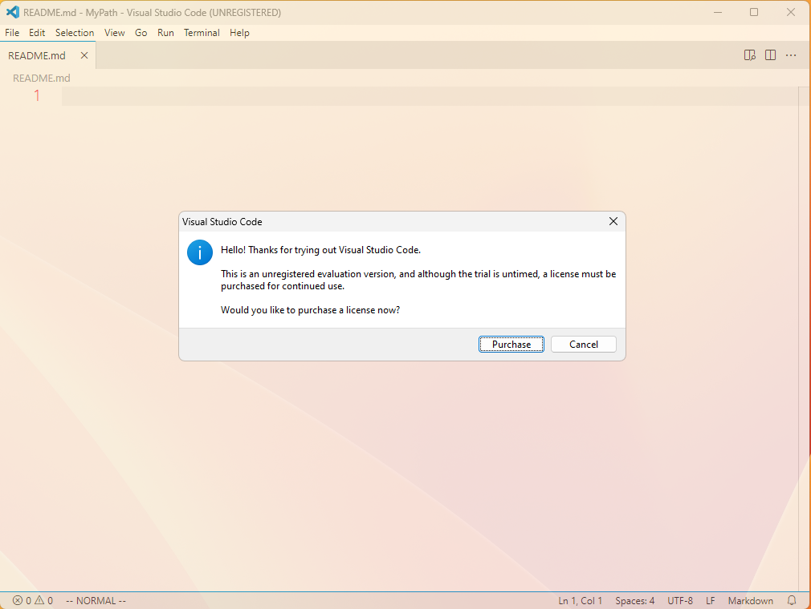

# A git's question-and-answer self-introduction

ARE YOU READY?

- **What is your name?** *> Septsea.*
- **How can I call you?** *> “Septsea” or “Nanami.”*
- **What kind of git are you?** *> Well, I do not know...*
- **When is your birthday?** *> On the twelfth of August.*
- **How old are you?** *> I would rather keep it a secret.*
- **What is your gender?** *> I am a boy.*
- **How tall are you?** *> I am approximately 1.60 meters tall.*
- **From where are you?** *> Lingling, Yongzhou, Hunan.*
- **What is your charming point?** *> Perhaps I possess none.*
- **Please do an impersonation.** *> Well, whatsoever.*
- **Where are you active?** *> At GitHub, Gitee, Bilibili and others.*
- **Staring greeting?** *> Hello!*
- **Ending greeting?** *> Let's call it a day!*
- **Fan emojis?** *> None.*
- **Repository tag?** *> I am not really sure.*
- **Fan art tag?** *> “Fan Fiction.”*
- **Fan name?** *> “A fan of Septsea.”*
- **Favorite color?** *> <text style="color:#FF7FAA;">#FF7FAA.</text>*
- **What are your hobbies?** *> (0) Surfing the Internet, (1) watching animations and (2) reading novels (light novels and visual novels) and comics.*
- **At what are you good?** *> I do not know.*
- **Now confess to love.** *> I will always love my waifus.*
- **Favorite food?** *> Spicy food.*
- **Favorite drink?** *> Water.*
- **Favorite manga?** *> “Swap ⇔ Swap.”*
- **Favorite anime?** *> “Kuttsukiboshi.”*
- **Favorite game?** *> “Letters From a Rainy Day - Oceans and Lace -.”*
- **Favorite music?** *> “Illusionary Daytime.”*
- **Any dislikes?** *> English.*
- **Who do you admire?** *> Big Brother.*
- **What is your dream?** *> I want to live happily.*
- **Some closing remarks, please. ♪** *> Thank you.*

---

Well. More information.

This kind of self-introduction was inspired by the YouTube video [https://youtu.be/V4L3YuhCUEY](https://youtu.be/V4L3YuhCUEY). A copy of that can be found at [https://b23.tv/av804459905](https://b23.tv/av804459905).

In British English slang, a *git* is a foolish or worthless person. I redefined it to be a person who uses `Git`. Maybe a more common way is to say *a `Git` user*.

~~I wrote a book on polynomials (my `strange-book-zero` repository), but that is not very good.~~ ~~*(The quality of source code of the book is so poor that the book cannot be complied properly without a considerable amount of time and effort.)*~~

~~I wrote another math book (my `calculus-with-almost-no-variables` repository). It plays calculus with almost no variables.~~

~~I used to have a Zhihu account.~~

I wrote ~~two~~ three math books, but none of them was not successful at all.

- Bilibili: [https://space.bilibili.com/38607620](https://space.bilibili.com/38607620)
- GitHub: [https://github.com/septsea](https://github.com/septsea)
- Gitee: [https://gitee.com/septsea](https://gitee.com/septsea)
- AniDB: [https://anidb.net/user/902643](https://anidb.net/user/902643)
- VNDB: [https://vndb.org/u182843](https://vndb.org/u182843)
- ~~Chaoli Club: [https://chaoli.club/index.php/member/5729](https://chaoli.club/index.php/member/5729)~~ ~~*(I rarely use it now.)*~~

I use Visual Studio Code (UNREGISTERED).

I am pleased to make your acquaintance.

---

> Quietly now I leave the Cam 
> As mute as I arrived; 
> Waving sleeve so slight, lest sky 
> Of cloudspeck be deprived.

(See [http://ssb22.user.srcf.net/zhimo](http://ssb22.user.srcf.net/zhimo).)
